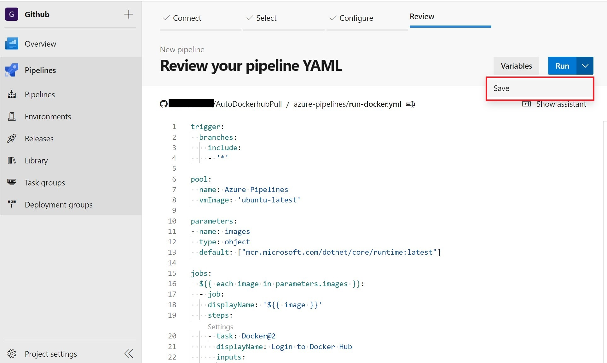

# AutoDockerhubPull

不久前 [dockerhub](https://hub.docker.com/) 公佈了新的映像存放政策。如果在過去6個月內沒有推送或拉出存放庫中的映像，該映像將被標記為非活動狀態並將被標記為刪除。詳細內容: [Resource Consumption Updates FAQ](https://www.docker.com/pricing/resource-consumption-updates)

本專案透過 Azure Pipelines 排程，預設每 4 個月自動到 dockerhub 探索指定帳號或組織的存放庫，並且拉出存放庫中的映像，防止映像被標記為非活動狀態並被刪除。

## 使用方法
1. Fork 本專案: [ChengYen-Tang/AutoDockerhubPull](https://github.com/ChengYen-Tang/AutoDockerhubPull) (備註: 不能將傳案設定成Private，否則 Azure Pipeliens 需要支付額外費用)

1. 到 Github Marketplace 取得 [Azure Pipelines](https://github.com/marketplace/azure-pipelines)

1. 進入 Azure Devops 的 Project Settings -> Service connections，點擊 New service connection
    

1. 選擇 Docker Registry， 然後 Next
    

1. Registry type 選擇 Docker Hub，並填寫必要資訊，**(重要)** Service connection name 填寫 DockerHub
    

1. 回到 Azure pipelines，點擊 New pipeline
    

1. 選擇 Github
    

1. 選擇剛剛 Fork 的 AutoDockerhubPull 存放庫
    

1. 選擇 Existing Azure Pipelines YAML file
    

1. Path 選擇 /azure-pipelines/run-docker.yml
    

1. 然後選擇 Save
    

1. 點擊倒退箭頭回到 Pipelines 頁面
    

1. 重複動作 6 ~ 9，然後 Path 選擇 /azure-pipelines/get-image.yml
    

1. 點擊右上角 Variables 按鈕
    

1. 點擊 New variable 按鈕
    

1. Name 的地方填 **username**， Value 填 Dockerhub 的 Docker ID，最後勾上 **Keep this value secret**，防止重要訊息顯示出來
    

1. 重複上面的動作，新增 **password** 及 **organization**，內容為 Dockerhub的密碼及組織
    

1. 完成後點擊 **Run** 便會開始探索Dockerhub上組織的存放庫，等第二個 pipeline 探索結束後會自動執行第一個 pipeline 開始 pull 所有 image
    
